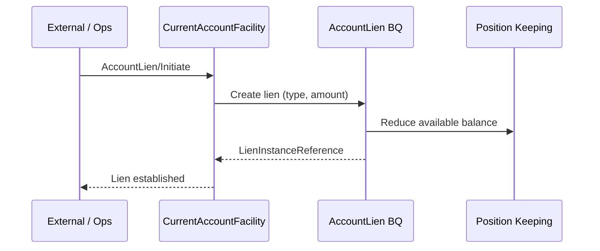
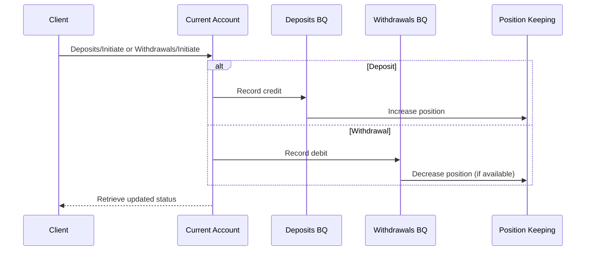

# Business Scenario: Current Account Facility Operations

**Primary domain:** Current Account (CR: CurrentAccountFacility).
**Related:** Position Keeping, Standing Order, Payment Execution.

## Control Record + Business Qualifiers

| Element | Role |
|---------|------|
| CurrentAccountFacility (CR) | Aggregate root: status, currency, party reference |
| Deposits (BQ) | Credit movements |
| Withdrawals (BQ) | Debit movements |
| AccountLien (BQ) | Holds reducing available balance |
| Payments (BQ) | Payment-related postings |

## Sequence: Initiate lien (hold)

## Sequence: Deposit / withdrawal

## Standard CR operations

- **Initiate** — open account facility
- **Update** — fees, sweeps, product attributes
- **Control** — suspend, freeze, close
- **Execute** — scheduled interest, automated sweeps
- **Retrieve** — balances, statements, history
- **Request** — manual fee waiver / exception

## Coding hints

- Available balance = ledger position − active liens/holds.
- Standing Order **Initiate** creates recurring instructions that later drive Payment Order/Execution.
