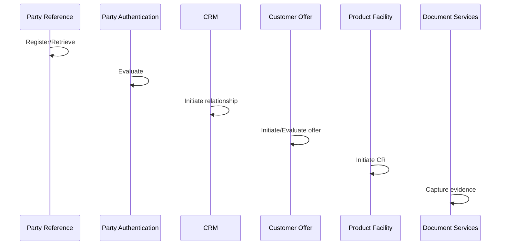

# Business Scenario: Customer onboarding (party → relationship → offer)

```text
1. Party Reference Data Directory — Register/Retrieve party
2. Party Authentication — Evaluate identity assurance
3. Customer Relationship Management — Initiate relationship
4. Customer Offer — Initiate/Evaluate product offer
5. Product-specific facility (Current Account / Loan / …) — Initiate CR
6. Document Services — capture evidence (AsyncAPI-friendly)
```


