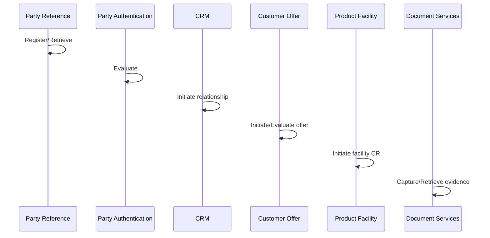

# Business Scenario: Customer onboarding

```text
1. Party Reference Data Directory — Register/Retrieve
2. Party Authentication — Evaluate
3. Customer Relationship Management — Initiate
4. Customer Offer — Initiate/Evaluate
5. Product facility (CA / Loan / …) — Initiate CR
6. Document Services — capture evidence
```



Security: KYC retention; minimize PII in vector index.
