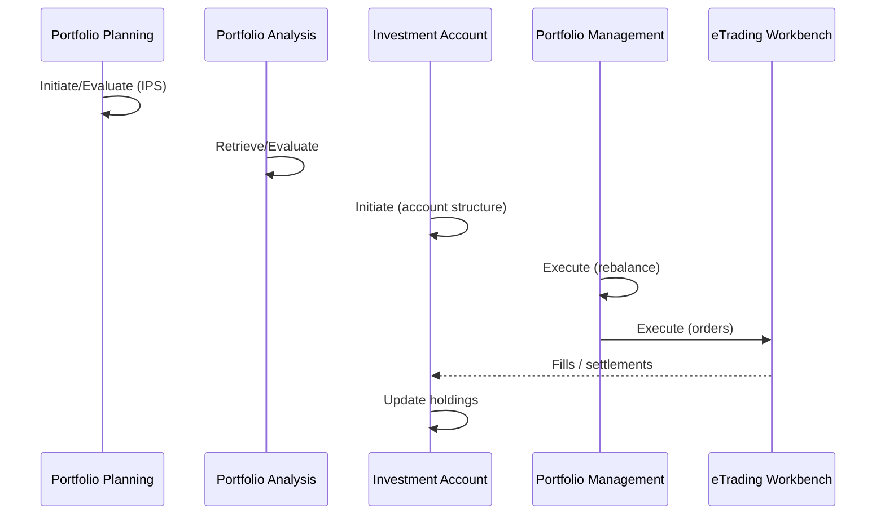

# Business Scenario: Investment Portfolio Planning → Management

```text
1. Party Reference / Customer Offer — suitability, IPS intake
2. Investment Portfolio Planning.Initiate/Evaluate — goals, allocation model
3. Investment Portfolio Analysis.Retrieve/Evaluate — risk, performance inputs
4. Investment Account.Initiate — custody/cash structure
5. Investment Portfolio Management.Initiate/Execute — rebalance, corporate actions
6. eTrading Workbench.Execute — order routing (markets tier)
7. Investment Account.Update — holdings and cash sweeps
```


