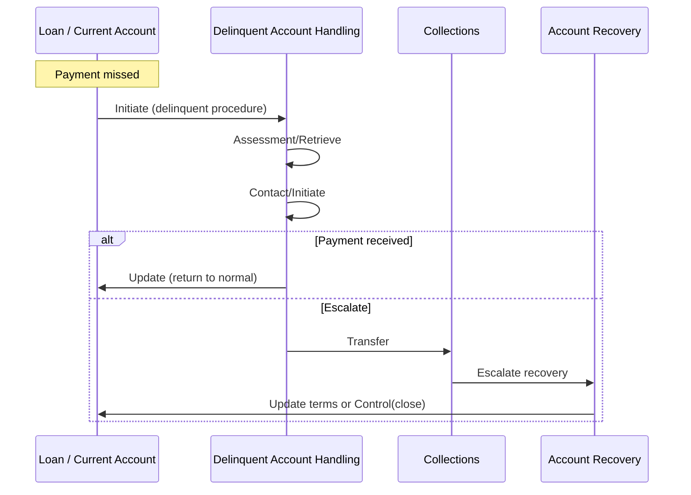

# Business Scenario: Loan Lifecycle and Delinquency Handoff

**Primary domains:** Loan, Credit Management, Collateral, Payment Execution.
**Related:** Delinquent Account Handling, Account Recovery, Collections.

## Happy path

```text
Loan.Initiate → facility CR
Loan.Execute / Payment* → disbursement
Repayment BQ / Payment* → scheduled collections
Loan.Retrieve → status, schedule, arrears
Loan.Control → close / restructure flags
```

## Loan CR + typical BQs

| BQ | Purpose |
|----|---------|
| Disbursement | Initial fund distribution |
| Repayment | Principal and interest schedule |
| Interest | Accrual and application |
| Fees | Fee assessment |
| Billing | Statements |
| Collateral / Lien | Security interest linkage |
| Restructuring | Term modifications |

## Delinquency handoff



## Agent rules

- Servicing racks answer schedule/arrears from **Loan** + product policy.
- Do not merge Credit Management assessment into Loan facility accounting.
