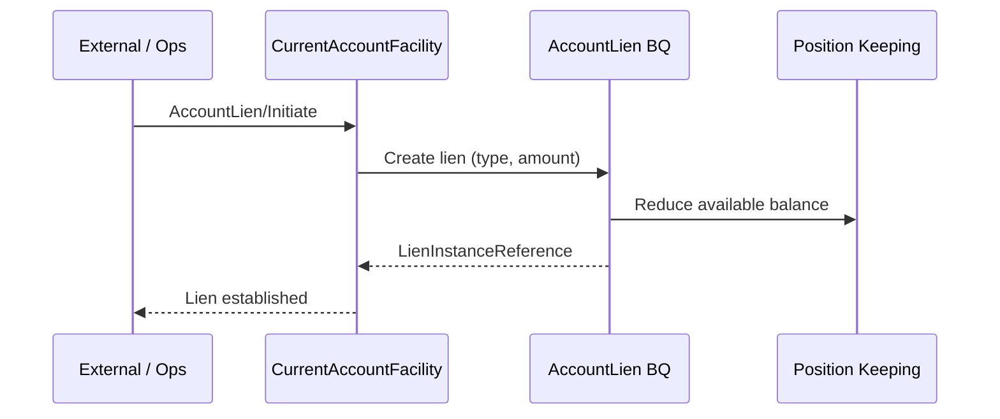

# Business Scenario: Current Account Facility Operations

**Primary domain:** Current Account (CR: CurrentAccountFacility).

## Control Record + Business Qualifiers

| Element | Role |
|---------|------|
| CurrentAccountFacility (CR) | Aggregate root |
| Deposits (BQ) | Credit movements |
| Withdrawals (BQ) | Debit movements |
| AccountLien (BQ) | Holds reducing available balance |
| Payments (BQ) | Payment-related postings |

## Sequence: Initiate lien

## Coding hints

- Available balance = ledger position − active liens/holds.
- Standing Order Initiate creates recurring instructions that drive Payment Order/Execution.
