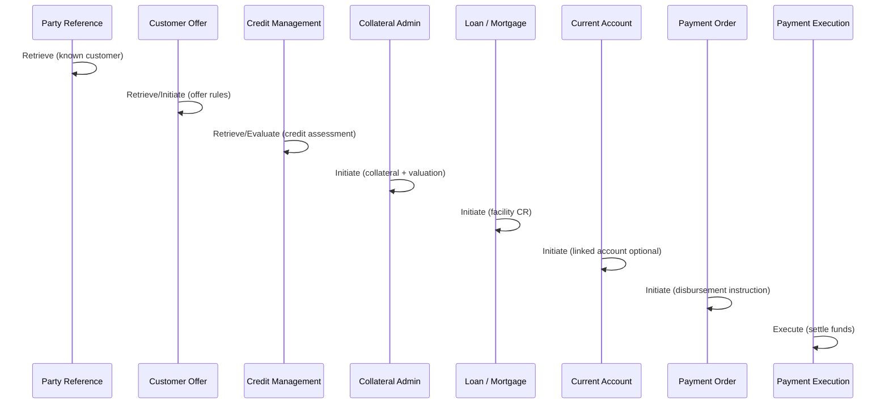

# Business Scenario: Customer Mortgage Application

**BIAN style:** End-to-end business scenario (service domain interaction sequence).
**Primary domains:** Party Reference, Customer Offer, Credit Management, Collateral Asset Administration, Loan/Mortgage, Current Account, Payment Order / Payment Execution.

## Sequence (logical order)

```text
1. Party Reference Data Management — Retrieve (known customer)
2. Customer Offer — Retrieve/Initiate (offer rules, eligibility)
3. Credit Management — Retrieve/Evaluate (credit assessment)
4. Collateral Asset Administration — Initiate (collateral + valuation)
5. Loan / Mortgage Loan — Initiate (facility CR)
6. Current Account — Initiate/Register (linked account optional)
7. Payment Order.Initiate → Payment Execution.Execute (disbursement)
```

## Mermaid



## Boundaries

| Domain | Owns | Does not own |
|--------|------|--------------|
| Customer Offer | Offer terms, acceptance | Facility balances |
| Credit Management | Assessment, limits advice | Collateral register |
| Collateral | Asset registration, valuation | Loan schedule |
| Loan | Facility CR, drawdown, repayment plan | Payment rail clearing |
| Payment Order | Instruction | Settlement finality |
| Payment Execution | Clearing/settlement | Facility accounting rules |
