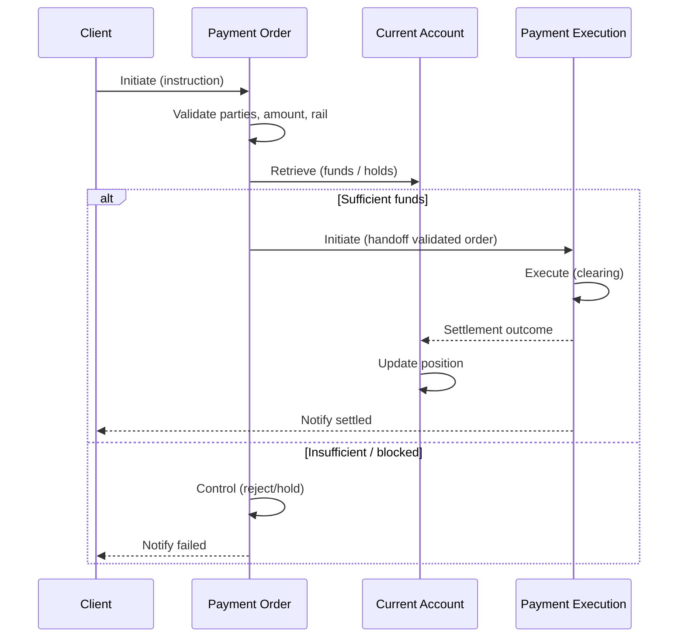

# Business Scenario: Payment Order → Payment Execution

**Primary domains:** Payment Order, Payment Execution, Current Account.

## Sequence

```text
1. Payment Order.Initiate — validate instruction
2. Current Account.Retrieve — funds / holds
3. Payment Execution.Initiate/Execute — clearing lifecycle
4. Current Account.Update — post settlement outcome
```

## Mermaid



## State machine (Payment Execution)

```text
accepted → in_clearing → settled
                ↘ failed
                ↘ returned
```
